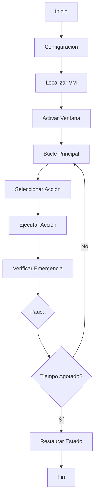

# Documentación Técnica - Simulador de Actividad Artificial en VM

## 📚 Contexto Académico

### Propósito de la Investigación
Este proyecto forma parte de una tesis académica que investiga los riesgos de seguridad asociados con la automatización de actividad en entornos corporativos. El objetivo es **educativo y preventivo**, demostrando a las empresas cómo los empleados podrían utilizar scripts de Python para crear actividad artificial en máquinas virtuales.

### Justificación Ética
- **Investigación académica**: El proyecto está diseñado exclusivamente para fines educativos
- **Concienciación**: Ayuda a las empresas a entender los riesgos potenciales
- **Prevención**: Proporciona herramientas para implementar medidas de detección
- **Responsabilidad**: Incluye múltiples mecanismos de seguridad y advertencias

## 🔧 Arquitectura Técnica

### Componentes Principales

#### 1. Script Principal (`simulador_actividad_vm.py`)
```python
# Funcionalidades principales:
- Detección automática de ventanas de VM
- Simulación de movimientos de mouse realistas
- Escritura con errores humanos
- Navegación por teclado
- Cambio entre aplicaciones
- Mecanismos de seguridad integrados
```

#### 2. Configurador Interactivo (`configuracion_vm.py`)
```python
# Características:
- Listado automático de ventanas disponibles
- Identificación inteligente de VMs
- Configuración guiada paso a paso
- Validación de parámetros
```

#### 3. Sistema de Pruebas (`test_dependencias.py`)
```python
# Verificaciones:
- Importación de dependencias
- Funcionalidad de bibliotecas
- Configuración del sistema
- Mecanismos de seguridad
```

### Flujo de Ejecución



## 🛡️ Mecanismos de Seguridad

### 1. Zona de Emergencia
```python
# Coordenadas: Esquina superior izquierda (50x50 píxeles)
ZONA_SEGURA_X = 50
ZONA_SEGURA_Y = 50

# Función de verificación
def verificar_emergencia():
    x, y = pyautogui.position()
    if x < ZONA_SEGURA_X and y < ZONA_SEGURA_Y:
        print("🛑 EMERGENCIA: Ejecución detenida")
        sys.exit()
```

### 2. Límite de Tiempo
```python
# Duración máxima configurable
DURACION_MINUTOS = 5

# Verificación en bucle principal
while (time.time() - tiempo_inicio) < (DURACION_MINUTOS * 60):
    # Ejecutar acciones
```

### 3. Restauración de Estado
```python
# Guardar posición original
start_x, start_y = pyautogui.position()

# Restaurar al finalizar
finally:
    pyautogui.moveTo(start_x, start_y, duration=0.5)
```

### 4. Detección de Pérdida de Foco
```python
# Verificar cada 5 acciones
if contador_verificacion % 5 == 0:
    ventana_activa = gw.getActiveWindow()
    if ventana_activa is None or ventana.title != ventana_activa.title:
        print("⚠️ Ventana de VM perdió el foco. Re-activando...")
        activar_ventana(ventana)
```

## 📊 Análisis de Comportamiento

### Distribución de Acciones
```python
# Probabilidades configuradas para simular comportamiento humano
accion = random.randint(1, 10)

if accion <= 3:        # 30% - Movimiento + clic
elif accion <= 6:      # 30% - Escritura
elif accion <= 8:      # 20% - Navegación
else:                  # 10% - Cambio aplicación
```

### Simulación de Errores Humanos
```python
# 20% de probabilidad de error tipográfico
if random.random() > 0.8:
    palabra = palabra[:-1]  # Omite última letra

# Velocidad variable entre teclas
interval=random.uniform(0.05, 0.2)
```

### Intervalos Variables
```python
# Pausas aleatorias entre acciones
pausa = random.uniform(INTERVALO_MIN, INTERVALO_MAX)
# Default: 5-15 segundos
```

## 🔍 Medidas de Detección Sugeridas

### 1. Análisis de Patrones de Mouse
```python
# Indicadores de actividad artificial:
- Movimientos demasiado regulares
- Velocidades constantes
- Secuencias repetitivas
- Falta de micro-movimientos humanos
```

### 2. Análisis de Intervalos Temporales
```python
# Patrones sospechosos:
- Pausas muy consistentes
- Intervalos exactos
- Actividad fuera de horarios normales
- Falta de variabilidad natural
```

### 3. Análisis de Comportamiento
```python
# Señales de alerta:
- Escritura sin errores tipográficos
- Navegación sistemática
- Uso simultáneo de múltiples aplicaciones
- Falta de pausas naturales
```

## 📈 Métricas de Evaluación

### Para la Tesis
1. **Efectividad de la Simulación**
   - Número de acciones por minuto
   - Distribución de tipos de acciones
   - Variabilidad en intervalos

2. **Capacidad de Detección**
   - Tiempo para identificar actividad artificial
   - Tasa de falsos positivos/negativos
   - Efectividad de diferentes métodos

3. **Impacto en Sistemas de Monitoreo**
   - Carga en sistemas de detección
   - Recursos computacionales requeridos
   - Escalabilidad de soluciones

## 🎯 Casos de Uso Académicos

### 1. Demostración a Empresas
```bash
# Ejecutar demostración sin VM real
python3 demo_simulador.py
```

### 2. Pruebas de Detección
```bash
# Configurar y ejecutar simulador real
python3 configuracion_vm.py
python3 simulador_actividad_vm.py
```

### 3. Análisis de Patrones
```bash
# Verificar dependencias
python3 test_dependencias.py
```

## 📋 Checklist de Implementación

### Antes de la Demostración
- [ ] Instalar dependencias: `pip install -r requirements.txt`
- [ ] Verificar funcionamiento: `python3 test_dependencias.py`
- [ ] Configurar VM: `python3 configuracion_vm.py`
- [ ] Probar demostración: `python3 demo_simulador.py`

### Durante la Presentación
- [ ] Explicar propósito educativo
- [ ] Mostrar mecanismos de seguridad
- [ ] Ejecutar demostración
- [ ] Discutir medidas de detección
- [ ] Responder preguntas sobre ética

### Después de la Demostración
- [ ] Documentar hallazgos
- [ ] Analizar métricas obtenidas
- [ ] Evaluar efectividad de detección
- [ ] Proponer mejoras

## 🔬 Metodología de Investigación

### Enfoque Cuantitativo
- **Métricas objetivas**: Número de acciones, intervalos, patrones
- **Análisis estadístico**: Distribución de comportamientos
- **Comparación**: Actividad humana vs. artificial

### Enfoque Cualitativo
- **Entrevistas**: Con profesionales de seguridad
- **Análisis de casos**: Incidentes reales documentados
- **Evaluación de impacto**: En políticas corporativas

## 📚 Referencias Académicas

### Áreas de Investigación Relacionadas
1. **Seguridad Informática**
   - Detección de intrusos
   - Análisis de comportamiento
   - Automatización de amenazas

2. **Psicología Organizacional**
   - Comportamiento en el trabajo
   - Motivación y productividad
   - Ética laboral

3. **Tecnología de la Información**
   - Automatización de procesos
   - Monitoreo de sistemas
   - Inteligencia artificial

## ⚖️ Consideraciones Éticas

### Principios Guía
1. **Beneficencia**: Contribuir al bienestar de las organizaciones
2. **No maleficencia**: No causar daño a sistemas o personas
3. **Autonomía**: Respetar la capacidad de decisión
4. **Justicia**: Distribuir beneficios y cargas equitativamente

### Medidas de Protección
- Uso exclusivo en entornos controlados
- Consentimiento informado de todas las partes
- Documentación completa de actividades
- Destrucción de datos sensibles

## 🎓 Contribución a la Academia

### Valor Educativo
- **Concienciación**: Sobre riesgos de automatización
- **Prevención**: Herramientas para detectar actividad artificial
- **Investigación**: Base para estudios futuros
- **Política**: Información para regulaciones

### Impacto Esperado
- Mejora en sistemas de detección
- Actualización de políticas corporativas
- Desarrollo de mejores prácticas
- Avance en investigación de seguridad

---

**Nota**: Esta documentación está diseñada para uso académico y debe ser utilizada de manera responsable y ética.